# TTI Care Web App and API

I am using one of my previous open-source projects for this project which is robust for role management. The project I am using can be found [here](https://github.com/AbrarJahin/Asp.NetCore_3.1-PostGRE_Role-Claim_Management).

## Already created users stored in the SqLite database

Super-Admin-

- ***Username*** - `abrar@jahin.com`
- ***Password*** - `abrar@jahin.com`

Doctor-

- ***Username*** - `doctor@doctor.com`
- ***Password*** - `doctor@doctor.com`

Patients-

1
- ***Username*** - `patient1@patient.com`
- ***Password*** - `patient1@patient.com`

2
- ***Username*** - `patient2@patient.com`
- ***Password*** - `patient2@patient.com`

3
- ***Username*** - `patient3@patient.com`
- ***Password*** - `patient3@patient.com`

4
- ***Username*** - `patient4@patient.com`
- ***Password*** - `patient4@patient.com`

5
- ***Username*** - `patient5@patient.com`
- ***Password*** - `patient5@patient.com`

*** All kind of verification is added for all form data (including duplication check)

## Api Doc

Api doc is shown with Postman in here.

1. Register User
```
Api Url- `/api/users/register`
Method- Post
```
Parameters are like this-

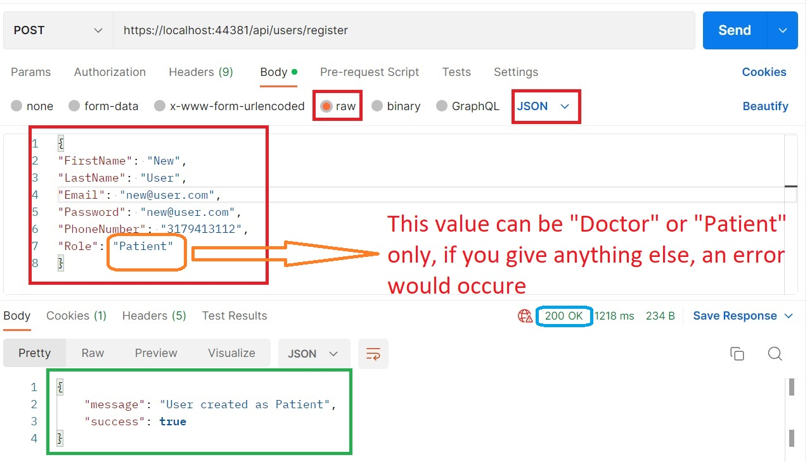

Red marked are parameters and green marked are server response and blue one are response code.

Now, if user is already in there, then you will get this-

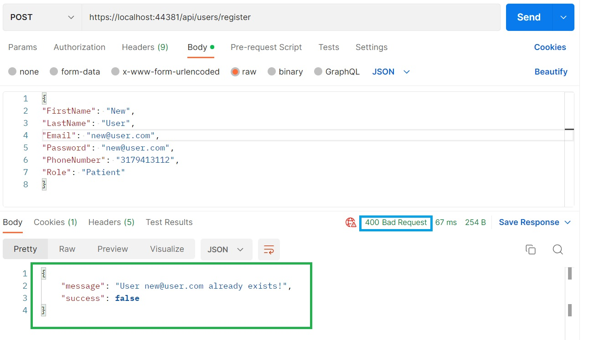
If anything fails, a bad request will be sent as well. And error will also be returned as well to understand the situation well-

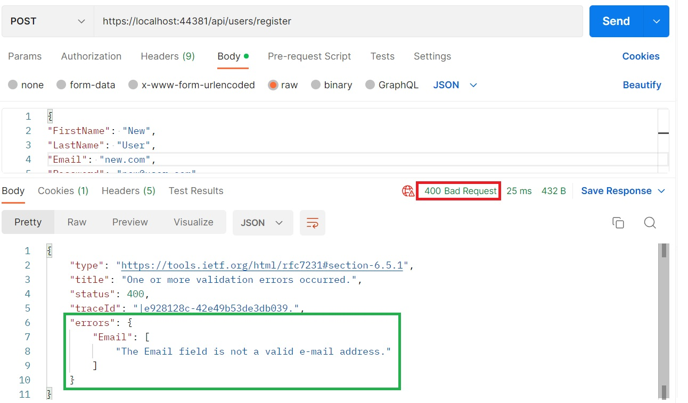

2. Login User
```
Api Url- `/api/users/login`
Method- Post
```
Parameters are like this-

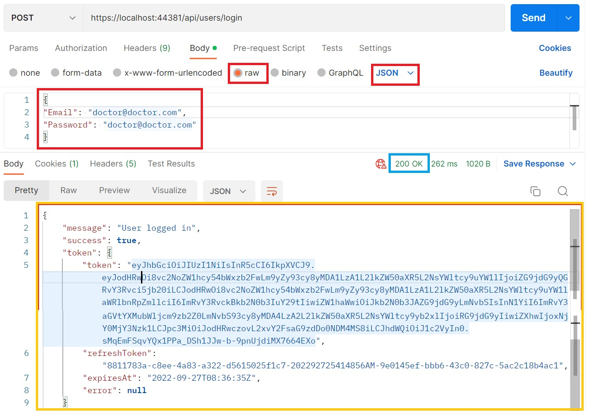

If velidation fails, tehn it will be like this-
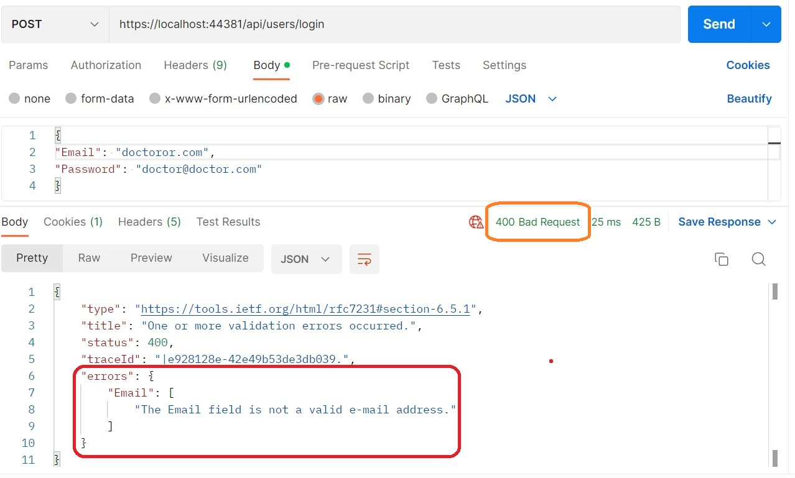
If login fails, then it will be like this-
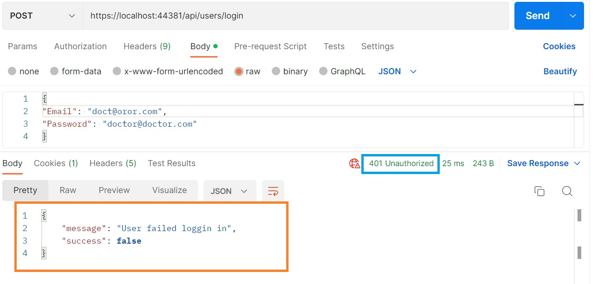

After successfull login, you will get 2 tokens-

* Token (which is short lived token)
* Refresh Token - which is needed for token regeneration

If token is timed out (which is configured from appconfig file), a new token can be generated which can be used for data access. Refresh token timeout is also configured from `appconfig.json` file.

3. Refresh Token
```
Api Url- `/api/users/RefreshToken`
Method- Post
```
Parameters and responses are like this-

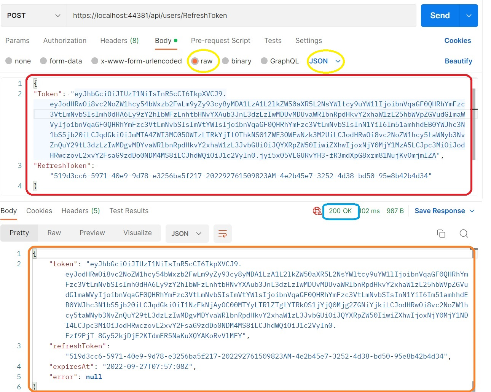

If error occured, the response is like this-

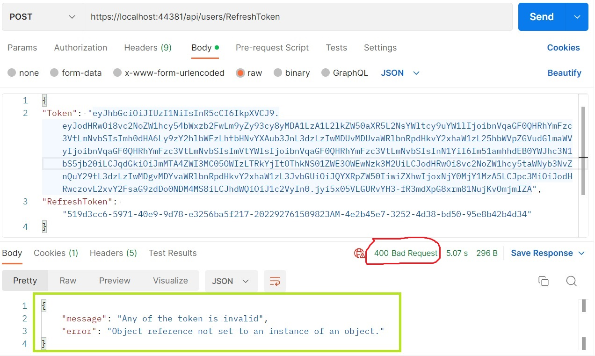

4. Assign Patient with a Doctor
```
Api Url- `/api/users/AssignToDoctor`
Method- Post
Authorization via JWT token - Yes
```
Authorization can be done like this (common for all JWT authorization in this app)
Parameters and responses are like this-

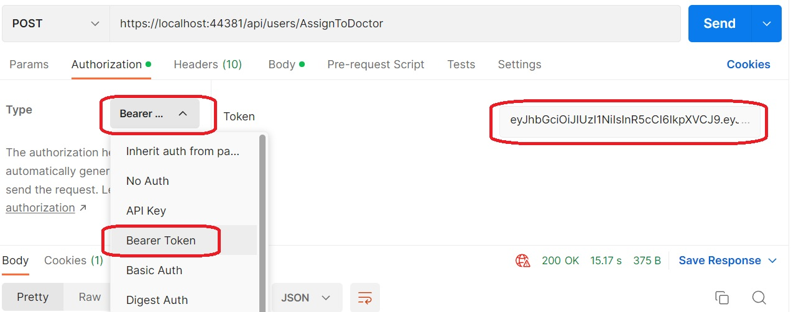

Calling API is like this-
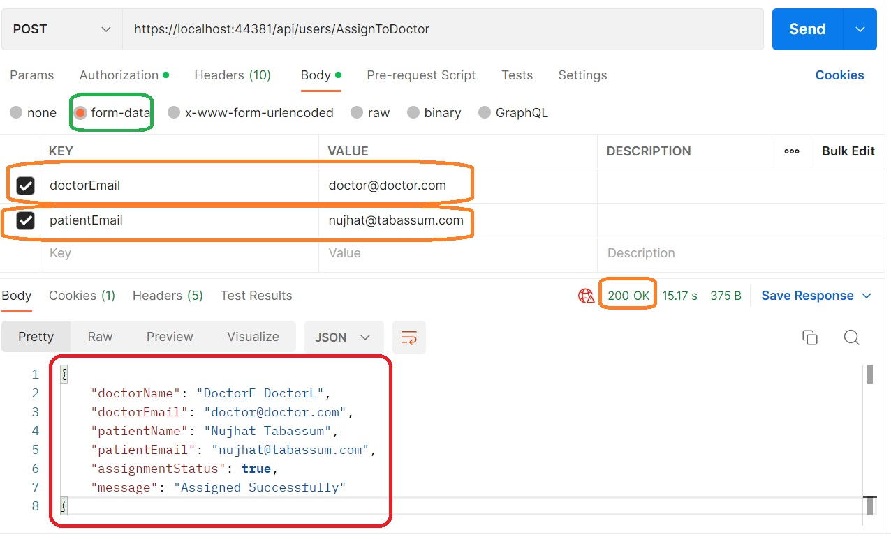

If any error, then it can be like this-


5. Check Doctor Patients (with pagination)
```
Api Url- `/api/users/GetCurrentDoctorPatients`
Method- Post
Authorization via JWT token - Yes
```
Authorization can be done like this (common for all JWT authorization in this app)
Parameters (no parameters needed for this API) and responses are like this-


Calling API is like this-
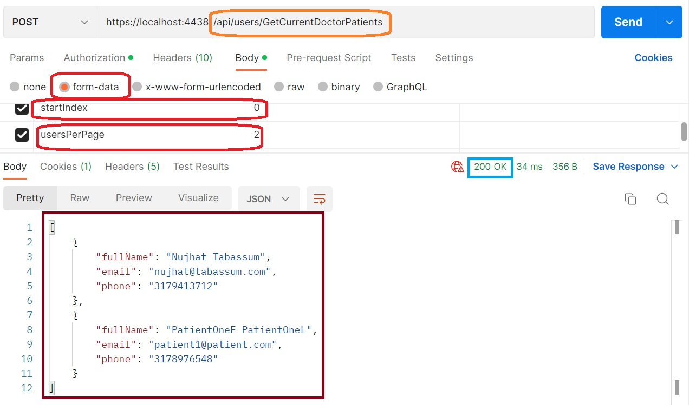

It will show the patients only assigned with the logged in doctor (user are verified with JWT token).

If you have any curicity, what is encoded inside the token, you can verify in [this website](https://jwt.io/) and it will be something like this-
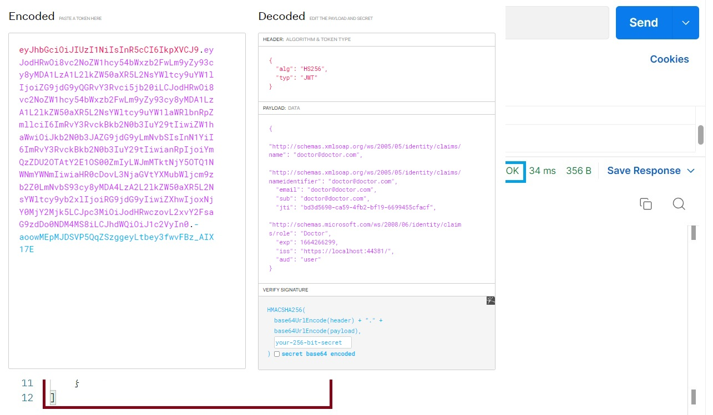

6. Get all users (with pagination)

In here you can get all users, get all doctors or get all patients.
```
API - /api/users/GetAllUsers
=> Get all Users
```

```
API - /api/users/GetAllUsers?userType=Doctor
=> Get all Doctore
```

```
API - /api/users/GetAllUsers?userType=Patient
=> Get all Users
```
Get method with JWT bearer token authintication (like before).
Example call-
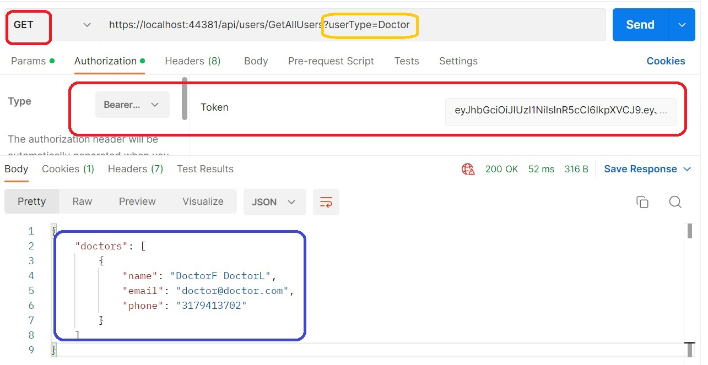
